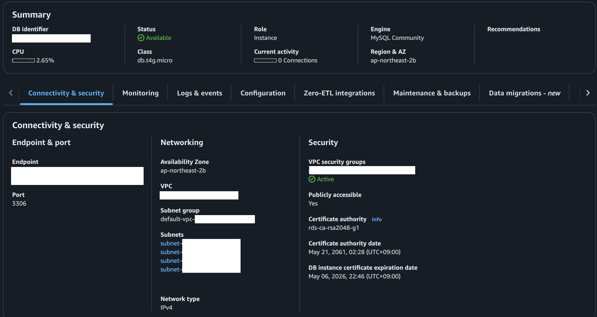

# SPRING PLUS

***

### 12. AWS 활용
+ EC2 설정

+ Security Group 설정

+ health check API
    - URL: http://<탄력적 IP>:8080/health
    - Method: GET
    - Response: "OK"
+ RDS 설정

+ S3 설정

### 13. 대용량 데이터 처리